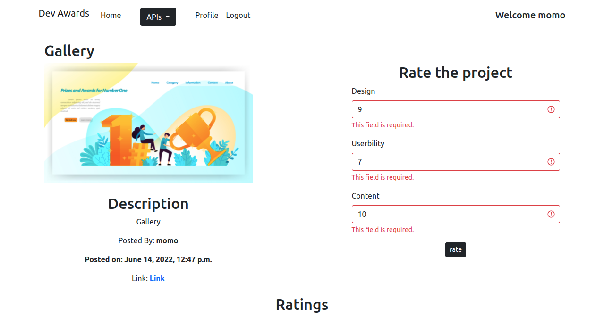

# Awards

## Author
Maureen Gichuki

## Description
This is a django app allows users to post, view and rate websites according to design, usability and content.
## User Stories

### Brief Description of the behaviours that have been implemented in the DevAwards application 

* View posted projects and their details
* Post a project to be rated/reviewed
* Rate/ review other users' projects
* Search for projects 
* View projects overall score
* View my profile page

## Installation
#### The application requires
* python3.8
* pip

## Cloning
* Open the terminal through {Ctrl+Alt+T}
* git clone [https://github.com/MaureenGichuki/Awards.git]

## Technologies Used
* python3.8
* Bootstrap4
* Html
* Css
* Django
* Postgres

## Contact Information
You can reach me at[maureenwaruguru@gmail.com]

## DevAwards

## You can view the site here
The DevAwards [https://mimoawards.herokuapp.com/]